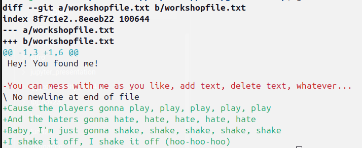
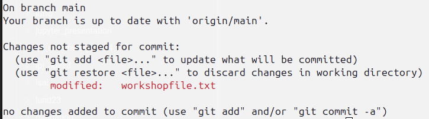
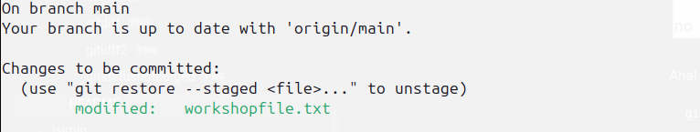
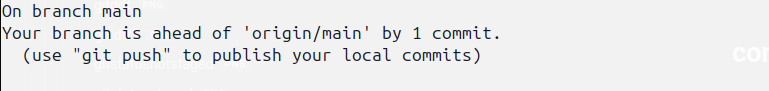
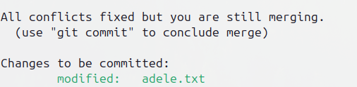

To prepare, please:

1. install `git` on your machine
	1. [http://git-scm.com/about](http://git-scm.com/about)
	2. Windows: git bash
2. Create an account on www.github.com

---
# what are we gonna do today?

1. explain git and github
2. a little hands-on workshop
3. set up a git repository in your own code

Note: I will focus on using the command line. You can also work with a user interface if you want. But the slides are for the command line. And I think it is good to do it at least once this way, to really know what is going on.

---
# git vs github

- git: version control system:
	- software that runs on your computer [http://git-scm.com/about](http://git-scm.com/about)
- github/gitlab:
	- online tool
		- "version control interface" or "continuous integration (CI) server"
		- visualizes a git repository
		- online backup of you code
		- collaborate with other (comment, raise issues)
		- run pipelines on the code (testing, formatting, ...)

---
# a visualization of a local git workflow


- dots: **commits**
- series of commits: **branches**
- dashed dot: **merge commit**

>After three **commits** on the **branch** "main" a **new branch** (called "feature") is created. Three **commits** are done on the **new branch**. In the meantime, two commits are done on the lower branch. Then, the top branch is **merged** into the lower branch, creating a **merge commit** (dashed dot). The lower branch now contains the merged code from both branches (blue + yellow = green). Finally, another commit is done on the lower branch. The upper branch does not exist anymore.

---
# why is this useful?

1. backup of your code online (with version history!)
2. go back in time with your code
3. see exactly what change, when, and why
4. store multiple version of the code (try out different approaches)
5. collaborate with others

---
# demonstration in my IDE (integrated developer environment)

- showing the log of commits
- going back in time
- showing current changes
- diffing files

---
# cloning an existing repository

We are going to start by cloning this repository, and messing around with it. So please execute:

```
git clone https://github.com/k-gregor/git-workshop.git
```

This downloads the repository onto your computer.

---

# seeing the files

- a new directory was created on your computer, `git-workshop`
- use the explorer (or terminal) to see which files are contained
	- You'll for instance see a `README.md` file (that's the file you're reading right now)
	- There should also be a `workshopfile.txt`
- do not worry about a `.git` directory for now (in case you see that)

---

# checking the status of the files and editing them

Let's first check the status of the local copy of the repository:
```
git status
```
You should see this message:
```bash
On branch main
Your branch is up to date with 'origin/main'.

nothing to commit, working tree clean
```
So, you see that you're on branch a branch called `main` and that it is up to date. Up to date with what? With `origin`. What's that? Well, `origin` is the name of the `remote`. Huh?? It's simple: the `remote` is the "online copy" of your repository that (in this case) is stored on GitHub. We could give this remote another name, but `origin` is the standard. Honestly, you'll likely never have to deal with different remotes. For now, just remember that a `remote` is a online copy (or backup) of your code, and the default `remote` is called `origin`

---

# editing files and checking status

Now, let's edit the file called `workshopfile.txt`. Add your favorite Backstreet's boys song text, your favorite joke, or simply let your cat walk over the keyboard: `asdfaisdgisudfhgkjsdfgkjadfg`.

Save that file and run `git status` again:

```shell
On branch main
Your branch is up to date with 'origin/main'.

Changes not staged for commit:
  (use "git add <file>..." to update what will be committed)
  (use "git restore <file>..." to discard changes in working directory)
	modified:   workshopfile.txt

no changes added to commit (use "git add" and/or "git commit -a")
```

Aha! It tells us that `workshopfile.txt` was modified! That's good!
But wait, why does it tell us that we're still `up to date`? Well, because these changes are not `staged for commit`. We will learn what that means later. For now, Let's be happy that `git` saw that we modified the file.

---
# seeing the changes

So now let's see what actually changed! For this we can use the command
```bash
git diff
```

The output should be something like this:


Don't worry about the stuff you don't understand from that output. But you should be able to see what changes were done to a file. This is already a huge benefit of `git`.

Now there are two options:
1. we are happy with the changes and certain we want to keep them
2. we are unhappy with the changes, and want to replace the Backstreet Boys text with Taylor Swift text

You probably guessed it, I'd much rather go for Taylor than Nick Carter and his friends. So let's undo the changes!! How do we do that?

---
# undoing unwanted changes

Let's undo the Backstreet Boys test. One way of course, would be to go into the file, and change everything back to the way it was. This might be possible here, but think about a large project! `git` offers the easy solution to that:
```
git checkout workshopfile.txt
```

`checkout`, that's a weird way to say `undo`!  Well, it means that we want to check out the file at exactly the current commit. And since nothing was committed by us so far (we'll do that in a few minutes), this means we'll get the file in its state that it was when we downloaded it:
```
On branch main
Your branch is up to date with 'origin/main'.

nothing to commit, working tree clean
```

Yup, everything back to normal.

---
# committing desired changes

So now let's add some high quality music text in that file (or whatever you like).
Check again `git status` and `git diff`


Yes, these are the changes we want to keep! So let's do that. It is a two-step process.

1. Add desired changes to the `staging area`
2. Commit the changes

Ready? Let's go!

---
# adding to staging area

Let's look at `git status` quickly:


Aha! There are changes `not staged for commit`. So let's stage them!
```
git add workshopfile.txt
```

What happened to `git status`?



There we go! Our changes can be committed!!

Note: if you have many edited files, you can add them with `git add .` (note the dot! It means "current directory")

---
# committing changes

```
git commit -m "I added my favorite Taylor Swift songtext"
```

Let's see what `git status` tells us now:



Perfect. We have created a new commit, and we're ahead of the online copy now (the commit only exists locally!). With `git push` you could push this commit online, to have an online backup. Normally you would do that now, but we save this for later.

---
# checking the history of the repository
Now let's see what has happened in this repository.
Run:
```bash
git log
```

You should see your last commit, and the ones that I have done to this repository previously.

---
# quick recap

Before we go to different topic, let's recap the commands we learned so far:

- clone
- status
- diff
- add
- commit
- push

---
# branching

Now we're getting to another key concept of git, **branching**


In our workshop, we're currently on the **main** branch. There are some commits by me, and the one that you just did. The repository looks something like this, there are no branches yet, just a few commits:


---

# creating a new branch

Say we now want to work on a new feature of our code. If you work by yourself, you don't need to create a new branch for this, but it can be helpful. Maybe you want to try out two different methods. Branching allows you to have to different states of your code simultaneously.
This is especially important when collaborating with other people. Everyone can have their own branch, and thus does not mess with the code of the others.
We create the branch like this:

```
git checkout -b adele_is_also_cool
```

---
# creating a new file and committing it

This is your task now: create a new text file called `adele.txt`, write some Adele lyrics into it, add it to the staging environment, and commit it.
You should be able to see that everything worked using `git status` and `git log`.

This is how the repository looks like:


# switching branches

Take a look at the file structure now. There is `workshopfile.txt` and there is `adele.txt`. And of course, the `README.md` and the `attachments`. Git status tells us we're on the `adele_is_also_cool` branch.

Now, lets switch branches back to **main**:

```
git checkout main
```

Remember what `checkout` means? It gives you the state of all files of a particular version of the code, in this case, from the `main` branch. What do you think will happen to the `adele.txt` file?

---
# where is adele?

Well, Adele is gone! The file `adele.txt` **only** exists on the `adele_is_also_cool` branch, not on the `main` branch! You see that the two branches are separate states of the code! So now you can imagine how two people can work on quite different stuff at the same time without interfering with one another.

How do we get Adele next to the main branch?

With another core concept of `git`: **merging**

---
# merging

Run the following command, **but** make sure you're actually on the `main` branch (use `git status`)

```
git merge adele_is_also_cool
```

This merges the content of the `adele_is_also_cool` into the `main` branch. The repository will look like this:


Check out `git log`! A new commit was added! A so-called **merge commit**.
Check out `git status`! We're still on the `main` branch!
Check out the files! Both `workshopfile.txt` and `adele.txt` are there!


---

# editing file in another branch

Adding a file in a different branch is a simple situation. Where it gets interesting is when the a file is edited that exists on multiple branches. In theory, it works the same. But, what happens when the file is edited in both branches?

##### Your task
1. Create a new branch called `britney`. Edit the `adele.txt` file. Write in "Hit me baby, one more time"
2. Add and commit the changes.
3. Switch to `main` branch
	1. check `git status`, there should be no changes to be committed!
	2. (note: non-committed but staged changes are moved between branches!)
4. Edit the `adele.txt` file. 
	1. Check that the Britney line is not in there
	2. Write in "I'm a genie in a bottle"
5. Add and commit the changes.

The repository looks something like this (I ignored the previous merging of the Adele branch):


---

# merge conflicts

Now, try to merge again the two branches (make sure you're on the `main` branch)

```
git merge britney
```

Whoopsie, that did not work! Both branches had edits to the `adele.txt` file. `git` did not know how to handle that.
```
Auto-merging workshopfile.txt
CONFLICT (content): Merge conflict in workshopfile.txt
Automatic merge failed; fix conflicts and then commit the result.
```

This is a so-called **merge conflict**.
Note: In many cases, git **does** know how to handle that. But sometimes, like here, you need to tell it what to do.
So you will take a look at the file, and keep only those lines that you want

# resolving the merge conflict

Let's look at the file that could not be merged (`adele.txt`). You should see something like this:

```
<<<<<<< HEAD
I'm a genie in a bottle
=======
Hit me baby, one more time
>>>>>>> britney
```

This tells you: on HEAD (your current position in the repository), there is the line "I'm a genie in a bottle". But coming from the `britney` branch, there is also the line "Hit me baby, one more time".
Now imagine this is code: you will have to decide which changes to your code make sense. You could keep both, or only one, or none of them, as you desire! The weird lines (`<<<<`, `====`, and `>>>>`) are from git, and are used by graphical user interfaces to make merging easier than doing on the command line. But here we will just do that.
I will keep both lines and change the files so that it looks like this (removing the git-lines):
```
I'm a genie in a bottle
Hit me baby, one more time
```

Save the file. Check `git status`. It tells you you're still `unmerged` 

![[attachments/unmerged_paths.png]]

Since we resolved the conflict, we can now add `adele.txt`
```
git add adele.txt
```

What is the status now?




So, we need to conclude the merge with
```
git commit
```

It will open an editor asking you for the commit message (Note, for some people, this will open the editor `vim` which is very complex. You exit `vim` by typing `:wq`).

The repository looks like this now (check `git log` to see the merge commit)


# recap

Wow! You did a lot already! Let's recap what we did

- branch
- checkout
- add
- commit
- merge
- merge conflicts

# setting up a git repository in your code

Now, let's make your code a git repository! This is very simple! Just go into the directory and type:

```
git init
```

--- 

# adding files to the repository and committing them

You know how to do that! Select some files that you want to put into version control, add, and commit them!

---

# setting up an online version control with github

- Log in to www.github.com
- Create new repository