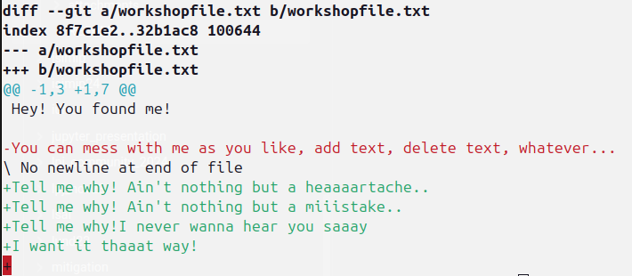

To prepare, please:

1. install `git` on your machine
	1. [http://git-scm.com/about](http://git-scm.com/about)
	2. Windows: git bash
2. Create an account on www.github.com

---
# what are we gonna do today?

1. explain git and github
2. a little hands-on workshop
3. set up a git repository in your own code

---
# git vs Github

- git: version control system:
	- software that runs on your computer [http://git-scm.com/about](http://git-scm.com/about)
- github/gitlab:
	- online tool
		- "version control interface" or "continuous integration (CI) server"
		- visualizes a git repository
		- online backup of you code
		- collaborate with other (comment, raise issues)
		- run pipelines on the code (testing, formatting, ...)

---
# a visualization of a local git workflow


- dots: **commits**
- series of commits: **branches**
- dashed dot: **merge commit**

>After three **commits** on the **branch** "main" a **new branch** (called "feature") is created. Three **commits** are done on the **new branch**. In the meantime, two commits are done on the lower branch. Then, the top branch is **merged** into the lower branch, creating a **merge commit** (dashed dot). The lower branch now contains the merged code from both branches (blue + yellow = green). Finally, another commit is done on the lower branch. The upper branch does not exist anymore.

---
# why is this useful?

1. backup of your code online (with version history!)
2. go back in time with your code
3. see exactly what change, when, and why
4. store multiple version of the code (try out different approaches)
5. collaborate with others

---
# demonstration in my IDE (integrated developer environment)

- showing the log of commits
- going back in time
- showing current changes
- diffing files

---
# cloning an existing repository

We are going to start by cloning this repository, and messing around with it. So please execute:

```
git clone https://github.com/k-gregor/git-workshop.git
```

This downloads the repository onto your computer.

---

# seeing the files

- a new directory was created on your computer, `git-workshop`
- use the explorer (or terminal) to see which files are contained
	- You'll for instance see a `README.md` file (that's the file you're reading right now)
	- There should also be a `workshopfile.txt`
- do not worry about a `.git` directory for now (in case you see that)

---

# checking the status of the files and editing them

Let's first check the status of the local copy of the repository:
```
git status
```
You should see this message:
```bash
On branch main
Your branch is up to date with 'origin/main'.

nothing to commit, working tree clean
```
So, you see that you're on branch a branch called `main` and that it is up to date. Up to date with what? With `origin`. What's that? Well, `origin` is the name of the `remote`. Huh?? It's simple: the `remote` is the "online copy" of your repository that (in this case) is stored on GitHub. We could give this remote another name, but `origin` is the standard. Honestly, you'll likely never have to deal with different remotes. For now, just remember that a `remote` is a online copy (or backup) of your code, and the default `remote` is called `origin`

---

# editing files and checking status

Now, let's edit the file called `workshopfile.txt`. Add your favorite Backstreet's boys song text, your favorite joke, or simply let your cat walk over the keyboard: `asdfaisdgisudfhgkjsdfgkjadfg`.

Save that file and run `git status` again:

```
On branch main
Your branch is up to date with 'origin/main'.

Changes not staged for commit:
  (use "git add <file>..." to update what will be committed)
  (use "git restore <file>..." to discard changes in working directory)
	modified:   workshopfile.txt

no changes added to commit (use "git add" and/or "git commit -a")
```

Aha! It tells us that `workshopfile.txt` was modified! That's good!
But wait, why does it tell us that we're still `up to date`? Well, because these changes are not `staged for commit`. We will learn what that means later. For now, Let's be happy that `git` saw that we modified the file.

# seeing the changes

So now let's see what actually changed! For this we can use the command
```bash
git diff
```

The output should be something like this:


Don't worry about the stuff you don't understand from that output. But you should be able to see what changes were done to a file. This is already a huge benefit of `git`.

Now there are two options:
1. we are happy with the changes and certain we want to keep them
2. we are unhappy with the changes, and want to replace the Backstreet Boys text with Taylor Swift text

You probably guessed it, I'd much rather go for Taylor than Nick Carter and his friends. So let's undo the changes!! How do we do that?

# undoing unwanted changes

Let's undo the Backstreet Boys test. One way of course, would be to go into the file, and change everything back to the way it was. This might be possible here, but think about a large project! `git` offers the easy solution to that:
```
git checkout workshopfile.txt
```

`checkout`, that's a weird way to say `undo`!  Well, it means that we want to check out the file at exactly the current commit. And since nothing was committed by us so far (we'll do that in a few minutes), this means we'll get the file in its state that it was when we downloaded it:
```
On branch main
Your branch is up to date with 'origin/main'.

nothing to commit, working tree clean
```

Yup, everything back to normal.

# committing wanted changes

So now let's add some high quality music text in that file (or whatever you like).
Check again `git status` and `git diff`

# checking the status of the repository
Now let's see what has happened in this repository.
Run:
```bash
git log
```


# setting up a git repository in your code

Very simple!

```
git init
```

--- 

# git status

- tells us the status of the repository, in which state are the files?


# git diff

# git commit


# git push


# branches

- 


# merging
